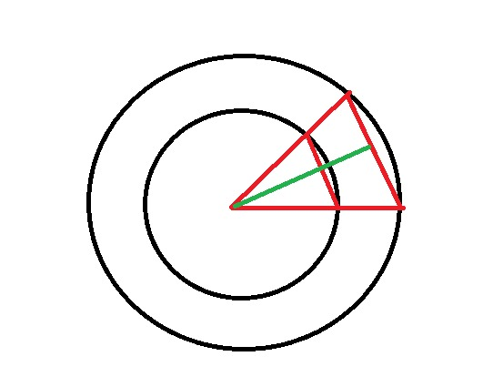

# Drawing in Flutter
Um estudo para desenho no canvas.

___
## <ins>Trigronometria (conceitos essenciais)</ins>

### para calculo de angulos
* $\pi$ = 180º em radianos, 2 * $\pi$ = 360º 
* 2 $\pi$ / lados = angulo de cada lado
* **Para desenhar um poligono equilátero, informando apenas o número de lados e a largura do lado, a seção circular de cada lado do poligono será um triangula equilátero. Para acharmos o raio, teremos de usar a forumla do SENO. para isso, dividiremos o triangulo equilátero no meio para resultar em 2 triangulos retangulos, onde a hipotenusa é o Raio. Neste caso o cateto oposto = largura do lado /2 e o SENO será da metade do angulo.**
**raio = (largura do lado \2) / SEN( $\alpha$ / 2)**

* Ou podemos passar apenas o número de lados e o raio(um pouco incomum) mas neste caso já temos tudo que é necessário.


  ***legenda:***
-  $\textcolor{red}{-}$ *seção circular do lado*
-  $\textcolor{green}{-}$ *raio (hipotenusa)*
  
### Senos cossenos e Tangentes
SEN( $\alpha$ ) = cateto oposto / hipotenusa 
COS( $\alpha$ ) = cateto adjacente / hipotenusa 
TAN( $\alpha$ ) = cateto oposto / cateto adjacente

___

## <ins>Aplicado no Flutter (canvas)</ins>

### CustomPainter (Abstract classe nativa)
Classe abastrata nativa, para criar uma forma personalizada. Exemplos:

#### `LinePainter` 
para desenhar uma linha:

  ```dart
    class LinePainter extends CustomPainter {
    @override
    void paint(Canvas canvas, Size size) {
        Paint paint = Paint()
        ..color = Colors.teal
        ..strokeWidth = 5
        ..strokeCap = StrokeCap.round;

        Offset startingPoint = Offset(0, size.height / 2);
        Offset endingPoint = Offset(size.width, size.height / 2);
        canvas.drawLine(startingPoint, endingPoint, paint);
    }

    @override
    bool shouldRepaint(CustomPainter oldDelegate) {
        return false;
    }
    }
  ```
#### `CirclePainter` 
para desenhar um Circulo:
  
  ```dart
    class CirclePainter extends CustomPainter {
        @override
        void paint(Canvas canvas, Size size) {
            Paint paint = Paint()
            ..color = Colors.teal
            ..strokeWidth = 5
            ..style = PaintingStyle.stroke
            ..strokeCap = StrokeCap.round;

            Offset centerPoint = Offset(size.width / 2, size.height / 2);
            double radius = 100;
            canvas.drawCircle(centerPoint, radius, paint);
        }

        @override
        bool shouldRepaint(CustomPainter oldDelegate) {
            return false;
        }
    }
  ```
#### `CirclePathPainter` 
para desenhar um Circulo a partir de um paht:
  
  ```dart
    class CirclePathPainter extends CustomPainter {
        @override
        void paint(Canvas canvas, Size size) {
            Paint paint = Paint()
            ..color = Colors.teal
            ..strokeWidth = 5
            ..style = PaintingStyle.stroke
            ..strokeCap = StrokeCap.round;

            double radius = 100;

            Path path = Path();
            path.addOval(
            Rect.fromCircle(
                center: Offset(
                size.width / 2,
                size.height / 2,
                ),
                radius: radius,
            ),
            );
            canvas.drawPath(path, paint);
        }

        @override
        bool shouldRepaint(CustomPainter oldDelegate) {
            return false;
        }
    }
  ```
#### `PoligonPainter`
Para desenhar poligonos (3 ou mais lados):
```dart
    class PoligonPainter extends CustomPainter {
        int sides;
        double radius;
        PoligonPainter({required this.sides, required this.radius});

        @override
        void paint(Canvas canvas, Size size) {
            Paint paint = Paint()
            ..color = Colors.teal
            ..strokeWidth = 5
            ..style = PaintingStyle.stroke
            ..strokeCap = StrokeCap.round;

            Path path = Path();

            double angle = (pi * 2) / sides;
           
            Offset center = Offset(size.width / 2, size.height / 2);
            Offset startingPoint = Offset(radius * cos(0.0), radius * sin(0.0));

            path.moveTo(
                startingPoint.dx + center.dx,
                startingPoint.dy +
                    center.dy); // movendo do ponto x=0 para centro e y=0 para centro

            for (int i = 1; i <= sides; i++) {
            double x = radius * cos(angle * i) + center.dx;
            double y = radius * sin(angle * i) + center.dy;

            path.lineTo(x, y);
            }

            path.close();
            canvas.drawPath(path, paint);
        }

        @override
        bool shouldRepaint(CustomPainter oldDelegate) {
            return false;
        }
    }
```

### CustomPaint (Widget nativo)

* **painter:** Um painter que pinta antes de child.
* **foregroundPainter:** Um painter que pinta após child.
* **child:** By default, o canvas vai pegar as medidas de child, se forem definidas.
* **size:** Se as menidas de child não forem definidas, então devem ser especificadas.

neste caso como child é o container (que ocupa a dimensão inteira do dispositivo, não é necessário especificar o size)

```dart
class MyPainter extends StatelessWidget {
  const MyPainter({super.key});

  @override
  Widget build(BuildContext context) {
    return Scaffold(
      appBar: AppBar(
        title: const Text('Lines'),
      ),
      body: CustomPaint(
        painter: LinePainter(),
        child: Container(),
        // foregroundPainter
        // size
      ),
    );
  }
}

```
### Lines
```dart
class LinePainter extends CustomPainter {
  @override
  void paint(Canvas canvas, Size size) {
    Paint paint = Paint()
      ..color = Colors.teal
      ..strokeWidth = 5
      ..strokeCap = StrokeCap.round;

    Offset startingPoint = Offset(0, size.height / 2);
    Offset endingPoint = Offset(size.width, size.height / 2);
    canvas.drawLine(startingPoint, endingPoint, paint);
  }

  @override
  bool shouldRepaint(CustomPainter oldDelegate) {
    return false;
  }
}
```

### Circle
Podemos desenha um Circulo de duas formas, usando o canvas.drawCircle ou canvas.drawPath(mais genérico)

#### canvas.drawCircle
```dart
class CirclePainter extends CustomPainter {
  @override
  void paint(Canvas canvas, Size size) {
    Paint paint = Paint()
      ..color = Colors.teal
      ..strokeWidth = 5
      ..style = PaintingStyle.stroke
      ..strokeCap = StrokeCap.round;

    Offset centerPoint = Offset(size.width / 2, size.height / 2);
    double radius = 100;
    canvas.drawCircle(centerPoint, radius, paint);
  }

  @override
  bool shouldRepaint(CustomPainter oldDelegate) {
    return false;
  }
}
```
#### canvas.drawPath
```dart
class CirclePathPainter extends CustomPainter {
  @override
  void paint(Canvas canvas, Size size) {
    Paint paint = Paint()
      ..color = Colors.teal
      ..strokeWidth = 5
      ..style = PaintingStyle.stroke
      ..strokeCap = StrokeCap.round;

    double radius = 100;

    Path path = Path();
    path.addOval(
      Rect.fromCircle(
        center: Offset(
          size.width / 2,
          size.height / 2,
        ),
        radius: radius,
      ),
    );
    canvas.drawPath(path, paint);
  }

  @override
  bool shouldRepaint(CustomPainter oldDelegate) {
    return false;
  }
}
```
**Tutorial by [Souvik Biswas](https://github.com/sbis04)** 
[https://blog.codemagic.io/flutter-custom-painter/](https://blog.codemagic.io/flutter-custom-painter/)

**Gostaria de agradecer a ajuda do meu irmão [Fabio Souza](https://github.com/frlps), com a Trigonometria :kissing_heart:**
